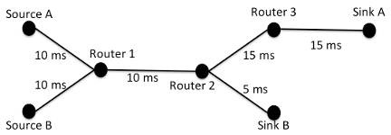
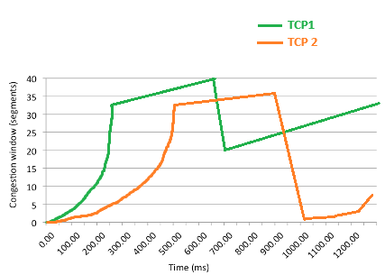
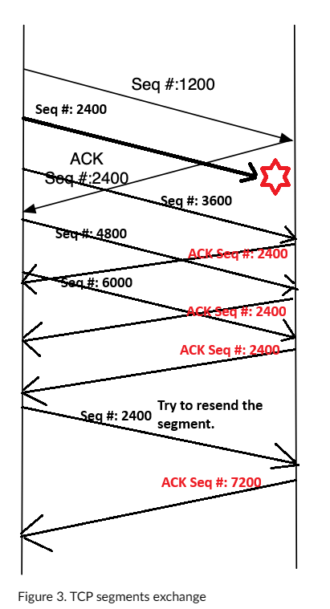
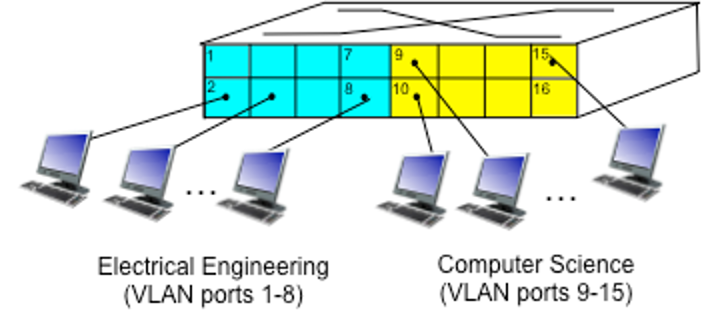
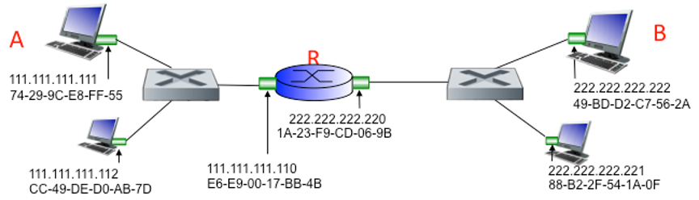
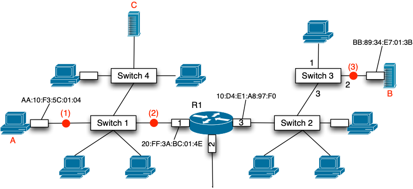

# Homework 02

```markdown
Name: Noctis Yamazaki Zhang
SPIRE ID: 34076138
```

## Problem 1

**Suppose Client A initiates a HTTP session with web server S. At about the same time, Client B also initiates a HTTP session with web server S. Provide possible source and destination port numbers for:**

1. **The segments sent from A to S.**
2. **The segments sent from B to S.**
3. **The segments sent from S to A.**
4. **The segments sent from S to B.**
5. **If A and B are different hosts, is it possible that the source port number in the 
segments from A to S is the same as that from B to S?**

For `1` to `4`, we have

| #    | Route    | Source Port | Destination Port |
| ---- | -------- | ----------- | ---------------- |
| 1    | A&rarr;S | 467         | 80               |
| 2    | B&rarr;S | 513         | 80               |
| 3    | S&rarr;A | 80          | 467              |
| 4    | S&rarr;B | 80          | 513              |

For `5`, the answer is yes. Since $A$ and $B$ have different IPs, it is sufficient for the server to distinguish the stream of packets belongs to which client.
## Problem 2

**For this problem, you should familiarize yourself with Figure 1 first. Now assume that in the network shown in Figure 1 two parallel TCP transmissions are performed. *TCP1* is a transmission between Source A and Sink A that uses *TCP Tahoe*. *TCP2* is a transmission between Source B and Sink B that uses *TCP Reno.* Initial *ssthresh* for both TCP transmissions is set to 32. In this specific scenario, no additional delay through forwarding is introduced. Thus, the RTT is only composed of the sums of the delay indicated on each link, times two.**




1. **For the *TCP 1* transmission, draw the resulting congestion window, assuming that a packet loss (triple duplicate ACKs) is detected at time t=900ms in Figure 2.**

2. **For the *TCP 2* transmission, draw the resulting congestion window, assuming that a packet loss (triple duplicate ACKs) is detected at time t=650ms in Figure 2.**

   

   The results for `1` and `2` can be seen in the figure above.

3. **Describe the benefit of TCP Reno over TCP Tahoe.**

   The key benefit of TCP Reno over TCP Tahoe is that it can handle packet loss more efficiently through its fast recovery approach. This helps for recovery without the need to reduce the congestion window.

4. **In general, explain the purpose of the receiver-advertised window in TCP.**

   The receiver can inform the sender about the amount of unacknowledged data that can be transmitted at a given time. This mechanism enables the recipient to regulate the flow of data it receives according to its present ability to process incoming data. 

5. **Assume a TCP sender transmits 5 TCP segments with respective sequence numbers 1200, 2400, 3600, 4800, 6000. The sender receives four acknowledgements with the following sequence numbers, 2400, 2400, 2400, 2400. Complete Figure 3 to show what TCP segments are exchanged between sender and receiver.**



The result can be seen above.

## Problem 3

**Suppose two nodes, A and B, are attached to opposite ends of an 1200m cable, and that they each have one frame of 1,500 bits (including all headers and preambles) to send to each other. Both nodes attempt to transmit at time t=0. Suppose there are four repeaters between A and B, each inserting a 40-bit delay. Assume the transmission rate is 100 Mbp, and CSMA/CD with backoff intervals of multiples of 512 bits times is used. After the collision, A draws K=0 and B draws K=1 in the exponential backoff protocol. Ignore the jam signal in this case.**

1. **What is the one-way propagation delay (including repeater delays) between A and B in seconds? Assume the signal propagation speed is $2*10^8$​​ m/sec.**

   $T_{A->B} = \frac{1200m}{2 \times 10^8 m/second} + \frac{4 \times 40 bits}{100 \times 10^6 bps} = 7.6 \times 10^{-6} second$

2. **At what time (in seconds) is A’s packet completely delivered at B?**

   In order for a single frame of data to get delivered, the time required is $T_{1frame} = \frac{1500}{100 \times 10^6} = 15 \times 10^{-6} second$. We assume that at $T=0$, the transmission starts. Then, when $T = T_{A->B}$, the two nodes will detect the potential collision, and both nodes stop the transmission. At $T = 2 \cdot T_{A->B}$, the last packet bit sent by B before stopping the transmission would be received by A. Similarly, at $T = 3 \cdot T_{A->B}$, the first bit sent by A arrives at B. Then, lastly, at $T = 3 \cdot T_{A ->B} + T_{1frame} = 37.8*10^{-6} second$, the whole packet sent by A before termination of the transmission arrives at B.

3. **Now suppose that only A has a packet to send and that the repeaters are replaced with switches. Suppose that each switch has a 20-bit processing delay in addition to a store-and-forward delay. At what time, in seconds, is A’s packet delivered at B?**

   We know that since there will be 5 switches, then the propagation delay would become $T_{new} = \frac{1200m}{5 \times 2 \times 10^8 m/second} = 1.2 \times 10^{-6} second$. The processing delay for the 20-bit is $T_{proc} = 0.2\times 10^-6 scond$ And the first switch has to wait $T_{wait} = (15 + 1.2 + 0.2) \times 10^{-6} = 16.4 \times 10^{-6} second$. Therefore, the total delay would be $T_{total} = 4 \times T_{wait} + T_{1frame} + T_{new} = 81.8 \times 10^{-6} second$.

   ## Problem 4

   **Consider the single switch VLAN in Figure 4, and assume an external router is connected to switch port 1. Assign IP addresses to the EE and CS hosts and router interface. Trace the steps taken at both the network layer and the link layer to transfer and IP datagram from an EE host to a CS host.**

   

   **For this problem, keep the following in mind:**

   - **Assume the IP addressing scheme for the EE and CS nodes follows the one indicated in Figure 5.**

     

   - **Assume that the EE VLAN has ID 11 and the CS VLAN has ID 12.**

   - **The first figure at the following link gives you an idea of the logical setup for such a scenario: https://www.practicalnetworking.net/stand-alone/routing-between-vlans/**

   1. **Assign IP addresses to the three nodes in the EE VLAN and to the three nodes in the CS VLAN. What’re the subnet masks for these two VLAN, if each department should be capable to host 200 hosts?**

      The first 3 nodes in EE department would have IP addresses as `111.111.1.1`, `111.111.1.2`, `111.111.1.3`, and the subnet mask would be `111.111.1.1/24`.

      As for the three nodes in CS department, they would have IP addresses as `111.111.2.1`, `111.111.2.2`, `111.111.2.3`, where the subnet mask would be `111.111.2.1/24`.

   2. **Describe how the router interface has to be set up. What 802.1q VLAN ID will be added to a frame that comes from subnet 111.111.111/24? What 802.1q VLAN ID will be added to a frame that comes from subnet 222.222.222/24?**

      As for the interface on the router, it can be programmed to have two sub-interface IPs such as `111.111.1.0` for the EE department, and `111.111.2.0` for the CS department. Both IP addresses have individual VLAN ID.  If the VLAN 11 is for EE department, and VLAN 12 is for the CS department, if a frame is sent by `111.111.1.1/24`, it will get a 802.1q tag from VLAN 11. On the other hand, frame coming from `111.111.2.1/24` will receive a 802.1q tag from VLAN 12.

   3. **Suppose that host A in the EE department would like to send an IP datagram to host B in CS department. What would be the steps taken at both the network layer and the link layer?**

      We assume that the IP address for A is `111.111.1.1`, and the IP for B is `111.111.2.1`, A encodes the IP datagram for 111.111.2.1 in a frame and directs it to the MAC address of the router interface linked to switch port 1. Upon receiving the frame, the router forwards it to the IP layer and decides to route the datagram to the `111.111.2/24` subnet via the sub-interface `111.111.2.0`. The router then encapsulates the IP datagram into a new frame and sends it out through port 1, this time adding a VLAN tag VLAN 12 as per the 802.1q standard. Upon detecting VLAN 12 in the incoming frame at port 1, the switch forwards the frame to B in the CS department's VLAN. B removes the 802.1q tag from the frame when it receives it.

## Question 6



**Consider the network shown above.**

1. **Consider an ARP request send by node B for node A. Whose IP-to MAC address translation is being queried?**

   The router interface 3.

2. **What is the destination MAC address on the frame containing the ARP request?**

   `10:D4:E1:A8:97:F0`.

3. **After B receives the ARP reply, what is contained in switch 3’s switching table?**

   Switch 3 is aware that Host B can be contacted through interface 2 due to the ARP request sent by B, and that router R1 can be accessed through interface 3 after receiving the ARP reply from R1.

4. **Assign IP addresses and subnet masks to hosts A, B, C, and interfaces 1 and 3 of R1. *Note:* Each of the subnets should be able to host a maximum of 17 hosts.**

   In this configuration, we know that each subnet is capable of hosting a maximum of 17 hosts per the statement, we would need $log_2{17}$, aka 5 address bits for each subnet. We assume that the subnet on the left has `AA:BB:CC:DD0ddddd/27`, `AA`, `BB`, and `CC` are each 8-bit numbers. `D` is a single bit, and `d` is used for address bits. Similarly, for the subnet on the right side, we have `AA:BB:CC:DD1ddddd/27`. Therefore, A and C can use any from `AA:BB:CC:DD000001` to `AA:BB:CC:DD011110` along with interface `1`. B can use the same interface `1` but from `AA:BB:CC:DD100001` to `AA:BB:CC:DD111110`.  

5. **Now consider the frame containing the B-to-A IP datagram. What are the MAC source and destination address of this frame and the IP source and destination addresses in the encapsulated IP datagram at points (1), (2), and (3).**

   | Point # | Source MAC        | Dest MAC          | Source IP (just an example) | Dest IP (just an example) |
   | ------- | ----------------- | ----------------- | --------------------------- | ------------------------- |
   | 1       | 20:FF:3A:BC:01:4E | AA:10:F3:5C:01:04 | AA.BB.CC.DD100001           | AA.BB.CC.DD000001         |
   | 2       | 20:FF:3A:BC:01:4E | AA:10:F3:5C:01:04 | AA.BB.CC.DD100002           | AA.BB.CC.DD000002         |
   | 3       | BB:89:34:E7:01:3B | 0:D4:E1:A8:97:F0  | AA.BB.CC.DD100003           | AA.BB.CC.DD000003         |

   


