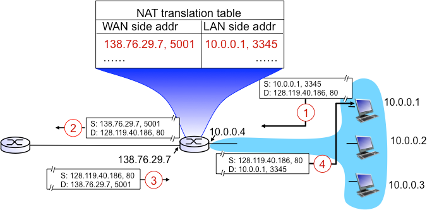

# Homework 03

## Problem 01:

Consider the network setup shown in **Figure 1.** Instead of the shown IP address the ISP instead assigns the router the address 129.109.112.235 and that the network address of the home network is 192.168.1/24.

1. **Assign addresses to all interfaces in the home network.**

   Since the network address of the home network is `192.168.1/24`, we can have the router's address set as `192.168.1.1`, and the hosts' addresses set as `192.168.1.2`, `192.168.1.3`, and `192.168.1.4`.

2. **Suppose each host has two ongoing TCP connections, all to port 80 at host 128.119.40.186. Provide the six corresponding entries in the NAT translation table.**

   In the table, we will have:

   |      | WAN side address      | LAN side address  |
   | ---- | --------------------- | ----------------- |
   | 1    | 129.109.112.235, 5001 | 192.168.1.2, 3345 |
   | 2    | 129.109.112.235, 5002 | 192.168.1.2, 3346 |
   | 3    | 129.109.112.235, 5003 | 192.168.1.3, 3345 |
   | 4    | 129.109.112.235, 5004 | 192.168.1.3, 3346 |
   | 5    | 129.109.112.235, 5005 | 192.168.1.4, 3345 |
   | 6    | 129.109.112.235, 5006 | 192.168.1.4, 3346 |

---

## Problem 02

**You are the network administrator of a fast-growing startup and have to get IP addresses to connect 1200 computers to the Internet. You can get IP addresses from two providers, BestIP and IP.com. BestIP sells classA, class B and class C blocks, while IP.com sells CIDR blocks. As the IPv4 address space is scarce, you want to save money and get the smallest number of addresses possible.**

1. **If you get one block from BestIP, which class do you have to get? What is the problem with that?**

   You should get a class B block. Since the class C would only give you $2^8-2 = 254$ IP addresses, the next best thing would be class B block. However, one block would contain $2^{16}-2 = 65534$ IP addresses, which is way too much than 1200 IP addresses that we are looking for.

2. **If you get one block from IP.com, how many bits are there in the mask (e.g., is it /8, /22)? How many addresses are wasted? (Assume that the first and last addresses of the block are not counted as available or used, i.e., pretend, for the calculations, that they don’t exist. The first address of a block is used as the network number, and the last one as the broadcast address for the subnet.)**

   Since $log_2{1200} \approx 10.2288 $, therefore, we need to buy a CIDR block with $2^{11}$ hosts. Then, that leaves $32-11=21$ bits for the mask. Therefore, the network mask would be $/21$. However, doing so will leave $2^{11}-2 - 1200=846$ IP addresses unused.

3. **Suppose you can get two blocks from IP.com, and they can be of different sizes. How many bits are there in the masks for each of the blocks? How many addresses are wasted now?**

   We can get a CIDR $/22$ block and a CIDR $/24$ block. In total, these 2 blocks would give us $2^{10}-2+2^8-2=1022+254=1276$ IP addresses. As a result, we are only wasting $1276-1200=76$ IP addresses.

**Assume you now work for IP.com and have a large number of consecutive addresses available starting at 198.17.0.0. You receive 2 requests for addresses, 4000 and 2000 in that order.**

1. **For each, give the first and last IP address assigned as well as the subnet mask.**

   As for 4000 consecutive IP addresses, we can do a CIDR $/20$ block, which gives $2^{32-20}-2 = 4094$ IP addresses. Therefore, we can assign the IP addresses as `198.17.0.0` to `198.17.15.255`, with a subnet mask of `255.255.240.0`.

   And for 2000 consecutive IP addresses, we can do a CIDR $/21$ block, which gives $2^{32-21}-2=2046$ IP addresses. Therefore, we can assign the IP addresses as `198.17.16.0` to `198.17.23.255`, with a subnet mask of `255.255.248.0`.

2. **Why is it best to minimize the number of CIDR blocks you allocate?**

3. **Why is it best to also minimize the size of the address blocks?**

**Assume the following routing table in a router.**

****

| **address/mask**   | **next hop**    |
| ------------------ | --------------- |
| **135.46.56.0/22** | **Interface 0** |
| **135.46.60.0/22** | **Interface 1** |
| **192.53.40.0/23** | **Router 1**    |
| **default**        | **Router 2**    |

****

**What is the next hop for each of these addresses, given that you use longest-prefix matching?**

1. **135.46.63.10**
2. **135.46.57.14**
3. **192.53.40.7**
4. **192.53.56.7**

