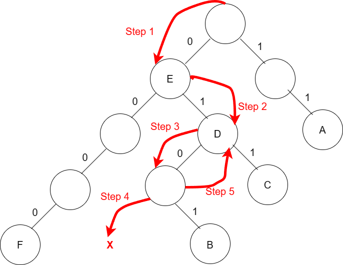
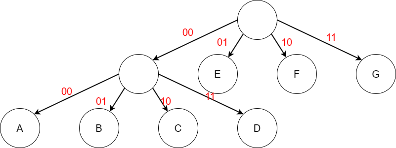
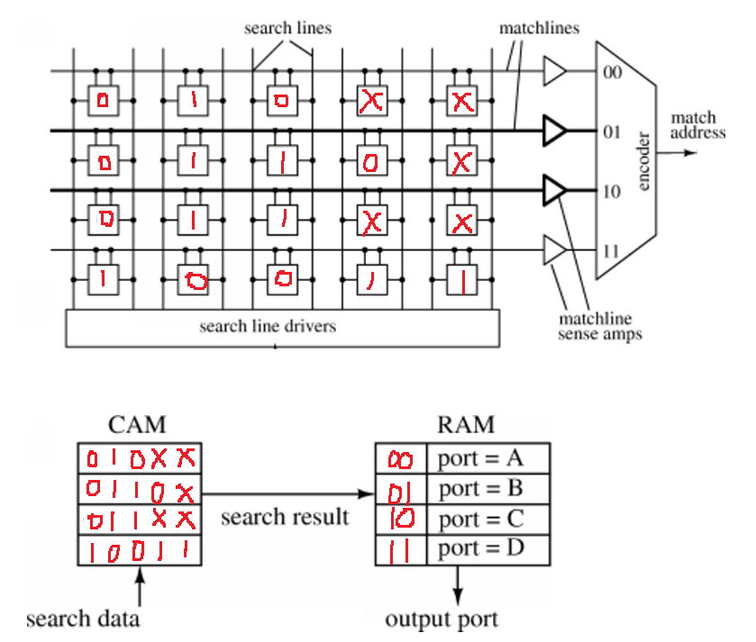
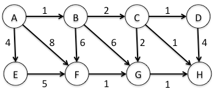
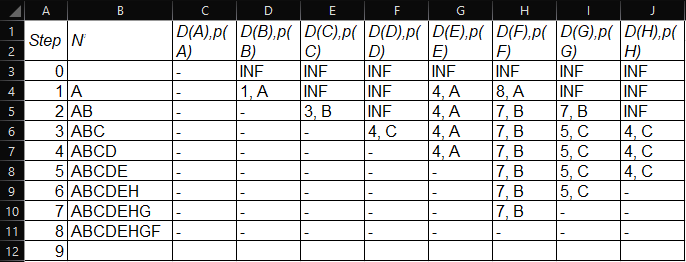
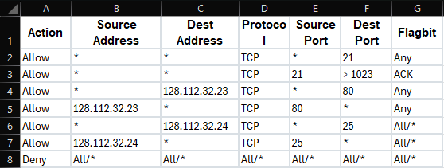

```bash
Name: Noctis Yamazaki Zhang
SPIRE ID: 34076138
```

## Homework #04

### **Problem 1 (25 Points): Prefix Matching**

1. **Consider a datagram network using 8-bit host addresses. Suppose a router uses longest prefix matching and has the following forwarding table:**

   | **Prefix Match** | **Interface** |
   | ---------------- | ------------- |
   | **0**            | **0**         |
   | **01**           | **1**         |
   | **000**          | **2**         |
   | **otherwise**    | **3**         |

   **For each of the four interfaces, give the associated range of destination host addresses and the number of addresses in the range.**

Based on the given table, we can derive that:

| Interface | Range of Destination Host Addresses | Number of Addresses |
| --------- | ----------------------------------- | ------------------- |
| 0         | 00100000 to 00111111                | $2^5=32$            |
| 1         | 01000000 to 01111111                | $2^6=64$            |
| 2         | 00000000 to 00011111                | $2^5=32$            |
| 3         | 10000000 to 11111111                | $2^7=128$           |

2. **Given the following forwarding table, create a binary tree that allows longest prefix match lookup.**

   | **Interface** | **Prefix** |
   | ------------- | ---------- |
   | **A**         | **11/2**   |
   | **B**         | **0101/4** |
   | **C**         | **011/3**  |
   | **D**         | **01/2**   |
   | **E**         | **0/1**    |
   | **F**         | **0000/4** |

   Based on the given prefix table, we can get:

   

3. **In that binary graph you created, show how a search for the appropriate interface for address 01001100 would be performed. Please indicate the individual steps in the correct order.**

   The process can be seen in red color in the figure shown above.

4. **Create a tree in which always two bits per step are looked up (Trie).**

   Based on the information, we can recreate one as shown below:

   

5. **Show how a TCAM realization for the following forwarding table would look like.**

   | **Interface** | **Prefix** |
   | ------------- | ---------- |
   | **A**         | **010****  |
   | **B**         | **0110***  |
   | **C**         | **011****  |
   | **D**         | **10011**  |

   Based on the given information, we can fill out a TCAM scheme as:

   

---

**Problem 2 (25 Points): QUIC**

1. **What is QUIC’s underlying transport layer protocol? Why did Google decide to make use of this transport protocol?**

   It would be UDP for the given underlying transport layer protocol. Though UDP does not have the implementation for reliability by default, but it is flexible enough for Google to add additional features on top of UDP.

2. **How many RTTs does it take in the case of HTTP over TCP until the first bit of a get request reaches the server? How many does it take in the case of HTTP over QUIC?**

   $1.5 \times$ RTTs over the regular HTTP. $0.5 \times$ RTTs over QUIC.

3. **Which protocols does QUIC replace?**

   We replace the part of TCP, for instance, the congestion control and retransmission, also the TLS 1.2 and part of the HTTP/2.

4. **Both SPDY and QUIC support multiplexing of multiple flows into one TCP session. Why is there still head of line blocking in the case of SDY?**

   SPDY operates on top of TCP, the underlying transport protocol, which ensures that packets are received in the correct order before they are passed to the application layer. This ordering is crucial for maintaining the integrity and effectiveness of data communication.

5. **QUIC makes use of an UUID. What’s the benefit of employing this UUID?**

   Using UUID helps to identify the session that belongs to the same client. Therefore, it helps enabling multipath transmission, and clients can have multiple network interfaces, for instance, having fiber and cellular connections at the same time.

---

### Problem 3 (30 Points): Routing

**Consider the following network. With the indicated link costs, use Djikstra’s shortest-path algorithm to compute the shortest path from *A* to all network nodes. Show how the algorithm works by computing a table below.**



The table containing results can be seen below:



---

### **Problem 4 (20 Points): Firewall**

**Provide a filter table and connection table for a stateful firewall that is as restrictive as possible but accomplishes the following:**

1. **Allow all internal users to establish File Transfer Protocol sessions with external hosts.**

2. **Allow external users to surf the company’s website at 128.112.32.23 and access the company’s mail server at 128.112.32.24.**

3. **Otherwise all inbound and outbound traffic should be blocked.**

   The results can be seen below:

