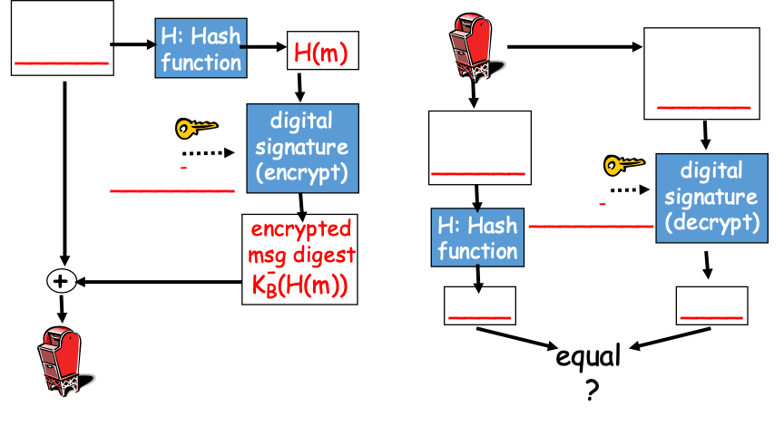
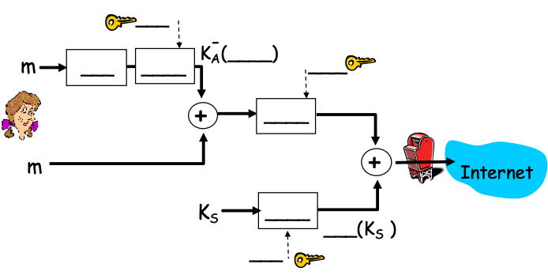
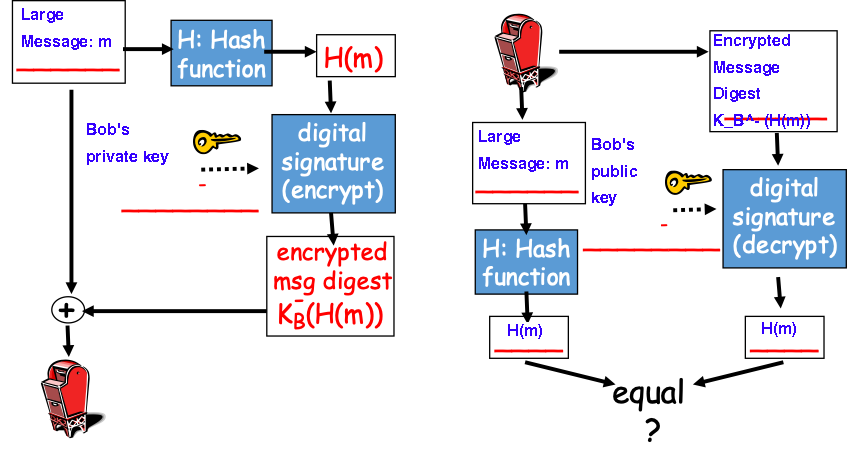
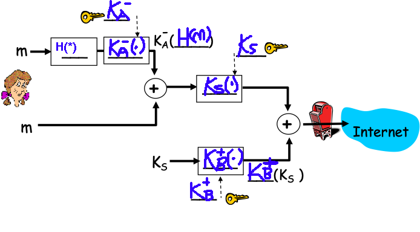
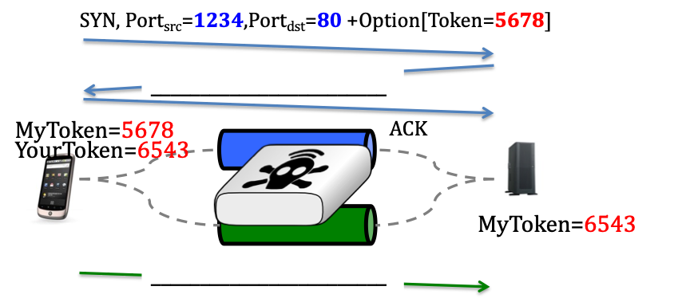
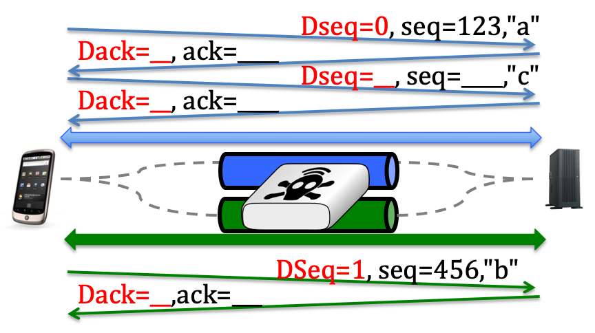
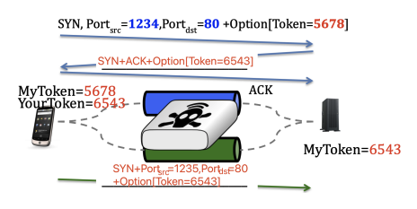
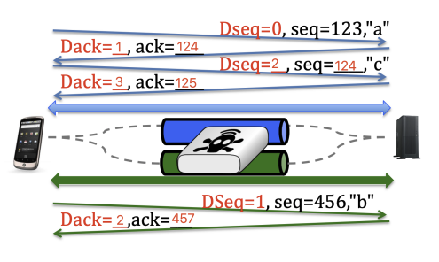

```bash
Name: Noctis Yamazaki Zhang
SPIRE ID: 34076138
```

---

## **Problem 1 (25 Points): Security**





1. **Name the TWO main requirements for a Public Key Encryption (PKE) algorithm.**

   1. **Security:** The encryption scheme needs to be highly secure and resistant to any possible cryptanalysis or attacks. This implies that it should be extremely difficult for someone to figure out the private key based on the public key or to decode the encrypted message without the matching private key.
   2. **Efficiency:** The algorithm needs to be optimized for computational resources, such as time and memory. The key generation, encryption, and decryption processes should be easily achievable with the computational power commonly available to users or systems, without causing any significant delays or demanding excessive processing power.

2. **This problem is concerned with digital signatures. In the example below Bob wants to send a message to Alice such that Alice can assure that the originator of the message has been Bob. Explain how authentication works by filling out the blanks in Figure 1.**

   

3. **Alice wants to send an email to Bob providing secrecy, sender authentication, and message integrity. Fill out the blanks in Figure2  to show which keys and cryptography methods are required to achieve Alice’s requirements?**




---

## **Problem 2 (25 Points): NDN**
**In this problem we take a look at the Named Data Networking approach, an instantiation of the Information Centric Networking paradigm, which is a candidate for the future Internet architecture.**

1. **Describe the actions that are taken once an Interest packet arrives at a router. Described the alternatives for the case that (a) the requested content is currently cached in the content store or (b) it is currently NOT cached in the content store.**

   a) If the content is already stored in the router’s cache, it is served directly from there. 

   b) If the content is not in the cache, the router creates an entry in the Pending Interest Table for the request. It then forwards the request based on the routing information in the Forwarding Information Base.

2. **Assume a scenario in which two clients are connected to the same router. Client A requests contents content */com/netflix/video123* at time *t1* and client B requests the same content at time *t2* ( *t2 > t1).* Show a snapshot of the routers pending interest table (PIT) after the request from client B has arrived (assuming the content is neither cached nor has it arrived from an upstream router or custodian).**

   | Prefix                | Interface |
   | --------------------- | --------- |
   | /com/netflix/video123 | 1, 2      |

   This scenario assumes that each client is connected to a different interface of the router. However, if both clients are connected to the same interface, only one entry will be listed under that interface in the router's configuration.

3. **Now assume the content has arrived before the request from client B arrives. How will the PIT look in this case?**

   There will be no entry in the Pending Interest Table for client B's request because the content can be served directly from the Content Store.

4. **Explain the function of the content store (CS). What happens if the content store is full (no additional storage space at the router) and a content arrives at the router?**

   The content store is a small cache within the router. Typically, the content that hasn't been requested for the longest period is removed to free up space for new content.

5. **Give an example for a forwarding information base (FIB) in NDN and explain the differences to a FIB in IPv4.**

   In Named Data Networking, the Forwarding Information Base specifies the interface(s) through which requests for a specific prefix should be forwarded. Then, in the FIB, the entries could be, for example:

   | Prefix        | Interface |
   | ------------- | --------- |
   | /com/netflix/ | 0         |
   | /edu/umass/   | 1         |

6. **Consider a live streaming event like the Super Bowl. Explain the advantages of NDN over TCP/IP in this specific scenario.**

   In TCP, each client request requires setting up a separate session. In contrast, Named Data Networking allows clients to be served directly from upstream routers, which can significantly reduce the number of outgoing streams from the server, potentially to just one in the best case scenario.


---

## **Problem 3 (25 Points): DASH**

**Answer the following questions assuming Dynamic Adaptive Streaming over HTTP (DASH) is used for video streaming.**

1. **When using DASH for streaming, does this require a dedicated streaming server or can a regular HTTP server be used? Why or why not?**

   For Dynamic Adaptive Streaming over HTTP, any standard HTTP server can be used. The client requests each segment with an HTTP request, and the server delivers the segment in a standard HTTP response.

2. **Give a brief explanation of the manifest file that’s stored on the server in addition to each video.**

   The manifest file provides details about the available quality levels for each segment stored on the server. Using this information, the client decides the quality level at which to request subsequent segments. For example, consider a video that is one minute long and divided into 10-second segments, available in five different quality formats. There would be six segments for each quality format, leading to six entries per format in the manifest file. Therefore, the manifest file would contain a total of 30 entries (5 formats x 6 segments each).

3. **Explain the client behavior in the case where the highest possible quality of the stream is currently transmitted to the client and the buffer fill has fallen below the minimum threshold.**

   To minimize buffering and avoid interruptions in video playback, the client requests the next segment that isn't already in the buffer at the lowest available quality level. This strategy helps fill the buffer quickly and prevent video starvation.

4. **Assuming a 5-minute video should be offered in 5 different quality versions and the DASH segment length is 10 seconds. How many individual files will have to be stored on the server if AVC encoding is assumed?**

   We can calculate it via: 

   $5 \times \frac{5 \times 60}{10} = 150 \ files$

---

## **Problem 4 (25 Points): MultiPath TCP**





1. **Explain why there has been a recent effort to split a TCP session in one or more subflows that are routed over different paths? Why was this not considered in TCP’s original design?**

   Mobile devices such as smartphones and tablets typically have multiple network interfaces, including cellular and Wi-Fi. As people move around with their devices, these devices may switch between these interfaces. When TCP was originally designed, mobile devices were not as prevalent as they are today, so there was no initial need to accommodate such switching in its design.

2. **Figure 3 illustrates the session setup for two subflows of a multipath TCP session. In the blank parts of this figure fill out the messages that are exchanged between the two end nodes. Also, briefly explain why this method for linking subflows is required.**

   Clients and servers need to identify which subflows belong to the same TCP flow to ensure that when data is transferred, TCP can correctly assemble the data segments and deliver them to the appropriate applications.

   The figure can be filled out as:

   

3. **Fill out the blanks in Figure 4 and explain why multipath TCP makes use of two levels of sequence numbers.**

   Multipath TCP experiences more head-of-line blocking compared to QUIC.

   The figure can be filled out as:

   

4. **What is the shortcoming of multipath TCP in comparison to QUIC when it comes to packet losses?**

**Explain what happens in the case of *i)* a fast retransmit, *ii)* timeout expiration, and *iii)* of loss of a subflow.**

i) Fast retransmission indicates that the subflow is still active, prompting MPTCP to attempt resending the packet via the same subflow. 

ii) A timeout suggests that the subflow has failed, necessitating a switch to an alternative subflow. 

iii) The loss of a subflow also compels MPTCP to redirect the traffic to another subflow.