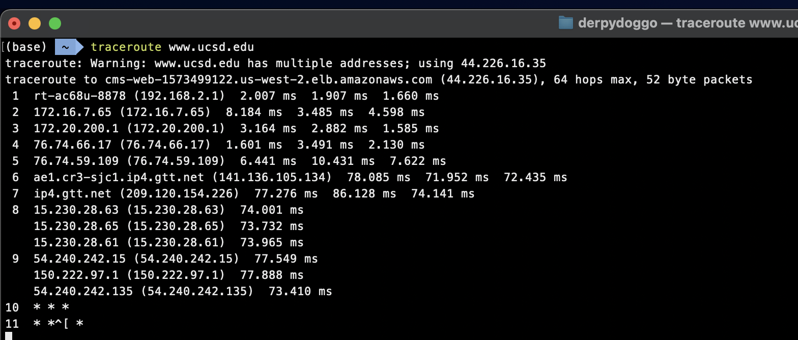
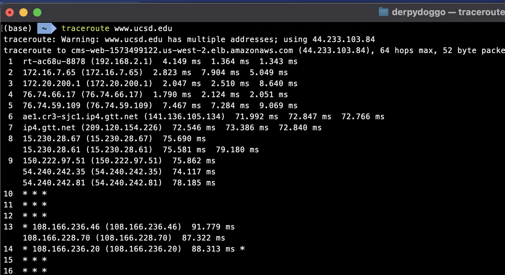
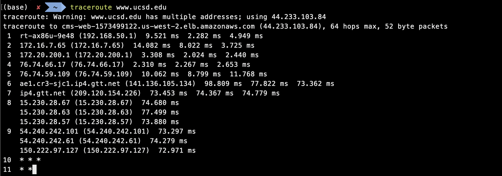
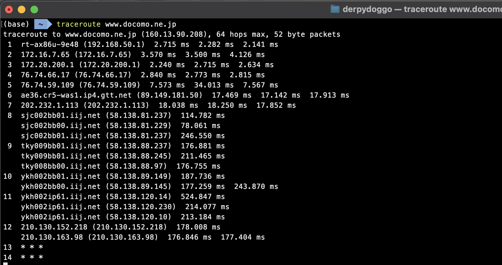
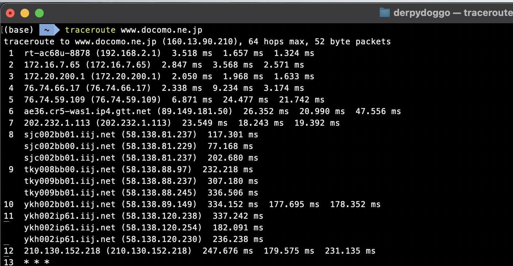
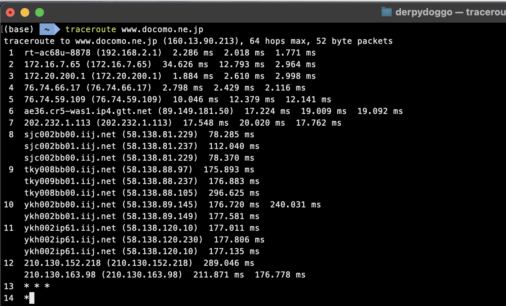

# Homework 01

`Name:` Noctis Yamazaki Zhang

`SPIRE ID:` 34076138

## Question 01

**Consider an application that transmits data at a steady rate (for example, the sender generates an *N*-bit unit of data every *k* time units, where *k* is small and fixed). Also, when such an application starts, it will continue running for a relatively long period of time. Answer the following questions, briefly justifying your answer:** 

**A. Would a packet–switched network or a circuit-switched network be more appropriate for this application? Why?**

A circuit-switched network could be a more optimal selection for the application outlined in the statement. The application's sessions will have a lengthy duration, and the data transmission needs may be anticipated and are likely to be consistent over time. If we utilize a circuit-switched network, we can allocate each session with little bandwidth waste, as the transmission rate for each session can be accurately estimated without the need to account for abrupt fluctuations.  The use of a packet-switched network is not optimal for applications that require continual and high-volume usage, as the network's performance deteriorates as the number of sessions increases. Additionally, packet-switched networks may incur greater installation expenses and include more intricate delivery protocols.

**B. Suppose that a packet-switched network is used and the only traffic in this network comes from such applications as described above. Furthermore, assume that the sum of the application data rates is less than the capacities of each and every link. Is some form of congestion control needed? Why?** 

No, there is no need for congestion control as the capacity of the network is larger than the overall bandwidth required by all sessions of the application. There is simply no congestion with almost no queuing happening throughout the transmission.

## Question 02

**This elementary problem begins to explore propagation delay and transmission delay, two central concepts in data networking. Consider two hosts, A and B, connected by a single link of rate *R* bps. Suppose that the two hosts are separated by *m* meters, and suppose the propagation speed along the link is *s* meters/sec. Host A is to send a packet of size *L* bits to Host B.** 

1. **Express the propagation delay, *dprop*, in terms of *m* and *s.***

   $dprop = \frac{m}{s} (seconds)$

2. **Determine the transmission time of the packet, *dtrans*, in terms of *L* and *R.***

   $dtrans = \frac{L}{R} \ (seconds)$

3. **Ignoring processing and queuing delays, obtain an expression for the end-to-end delay.**

   If we ignore the the potential delays, the end to end delay would be $de-t-e = dprop+dtrans = \frac{m}{s} + \frac{L}{R} \ (seconds)$

4. **Suppose Host A begins to transmit the packet at time *t=0*. At time *t=dtrans*, where is the last bit of the packet?**

   At $t=dtrans$, the last bit of the packet just got pushed out from Host A.

5. **Suppose *dprop* is greater than *dtrans*. At time *t=dtrans*, where is the first bit of the packet?**

   If $dprop > dtrans$, then although the first bit of the packet left Host A, it has not yet reach to Host B.

6. **Suppose *dprop* is less than *dtrans*. At time *t=dtrans*, where is the first bit of the packet?**

   If $dprop < dtrans$, then the first bit of the packet has already been received by Host B.

7. **Suppose $s=2.5\times10^8 m/s$​, L=500 bits, and *R=128* kbps. Find the distance *m* so that *dprop* equals *dtrans*.** 

   In this case, assume $s=2.5 \times 10^8 m/s$ (cuz it was printed as 108 m/s on canvas, which does not make sense), we have

   $m = \frac{S \times L}{R} = \frac{2.8 \times 10^8 \times 500}{128\times 10^3} = 976,000 (meters)$

## Question 03

**A packet switch receives a packet and determines the outbound link to which the packet should be forwarded. When the packet arrives, one other packet is halfway done being transmitted on this outbound link and four other packets are waiting to be transmitted. Packets are transmitted in order of arrival. Suppose all packets are 2,400 bytes and the link rate is 2 Mbps. What is the queuing delay for the packet? More generally, what is the queuing delay when all packets have length *L*, the transmission rate is *R*, *x* bits of the currently-being-transmitted packet have been transmitted, and *n* packets are already in the queue?** 

The size of the packet $L = 2400$, the transmitted bits $x=\frac{2400}{2}=1200$, then the remaining bits would be $L-x = 1200$. Then the queuing delay can be calculated as $Tq =\frac{4.5 \times2400\times8}{2\times10^6} = 4.32\times10^-2 (seconds) = 43.2 (ms)$. 

However, generally speaking, the queuing delay shall be computed as $Tq = \frac{n\times L+ (L-x)}{R}$.

## Question 04

**Perform a Traceroute (command “traceroute” on Unix systems and “tracert” on Windows systems) between your computer and *www.ucsd.edu* at three different hours of the day. (Add screenshots of the three Traceroutes to your answer!). Note, the traceroute might not go all the way through to the web server. In that case you can abort at a router that partly matches the following name** 

> ***uwcr-atg-1.infra.washington.edu*.** 

1. **Find the average and standard deviation of the round-trip delays at each of the three hours.**

   | #    | RTT1 | RTT2 | RTT3 | Average  | Std.      |
   | ---- | --------------- | --------------- | --------------- | -------- | --------- |
   | 1    | 77.549 ms       | 77.888 ms       | 73.410 ms       | 0.076282 | 0.0024933 |
   | 2    | 75.862 ms       | 74.117 ms       | 78.185 ms       | 0.076055 | 0.0020408 |
   | 3    | 73.297 ms       | 74.279 ms       | 72.971 ms       | 0.073516 | 0.0006809 |

   The results can be found in the table above. But we do need to notice that since the site is hosted by AWS, the destination we can arrive at is no longer a webserver described in the statement.

   

   

   

2. **Find the number of routers in the path at each of the three hours. Did the paths change during any of the hours?**

   | #    | Hop1 | Hop2 | Hop3 |
   | ---- | --------------- | --------------- | --------------- |
   | 1    | 9               | 9               | 9               |
   | 2    | 9               | 9               | 9               |
   | 3    | 9               | 9               | 9               |

   The paths are indeed changing over time. Although, we need to notice that the site is now hosted on AWS. And sometimes, AWS does have weird behaviors to reroute packets to somewhere else, see in screenshot for trial 02.

3. **Try to identify the number of ISP networks the Traceroute packets pass through from source to destination. Routers with similar names and/or similar IP addresses should be considered as part of the same ISP. In your experiments, do the largest delays occur at peering interfaces between adjacent ISPs?**

   After the 3rd hop, our packet leaves the wifi router, and from 4th to 5th, it is traversing through the ISP provider called SingleDigit, and then it enters Tier 1 Network from gtt.net from 6th to 7th. Then, from 8th to 9th, the packet enters AWS cloud.

4.  **Repeat the above for a destination on a continent different then the source. Compare the intra- and inter-continent results.** 

   And for this one, I attempted to visit

   > www.docomo.ne.jp

   which is the telecom provider from Japan.

   

   

   

   The results can be seen as:

   | #    | RTT1 | RTT2 | RTT3 | Average  | Std.      |
   | ---- | --------------- | --------------- | --------------- | -------- | --------- |
   | 1    | 178.008 ms      | 176.846 ms      | 177.404 ms      | 0.177419 | 0.0005811 |
   | 2    | 247.676 ms      | 179.575 ms      | 231.135 ms      | 0.219462 | 0.0355194 |
   | 3    | 289.046 ms      | 211.871 ms      | 176.778 ms      | 0.225898 | 0.0574334 |

   | #    | Hop1 | Hop2 | Hop3 |
   | ---- | --------------- | --------------- | --------------- |
   | 1    | 12              | 12              | 12              |
   | 2    | 12              | 12              | 12              |
   | 3    | 12              | 12              | 12              |

   We can tell that the paths were changing as well. And compared to intra-continent destination, the number of hops does increase, and RTT also increases. And during busy time of the day, the variation in RTT is greater than non-busy time. However, thanks to the awesome ISP I have, it is much more stable than other providers such as UMass and Xfinity.

## Question 05

**Suppose you would like to urgently deliver 30 terabytes of data from Boston to Los Angeles. You have a 500 Mbps dedicated link for data transfer available. Would you prefer to transmit the data via this link or instead use FedEx overnight delivery? Explain.** 

FedEx Overnight Delivery might be a better option, if there is no damages happening during the transportation.

First, we calculate the amount of time for us to use the 500 Mbps dedicated link to transfer such a large amount of data.

$T_{transfer} = \frac{30 \times 10^12 \times 8}{500 \times 10^6} = 480,000 (seconds)$, which is roughly 5.6 days. Therefore, FedEx Overnight Delivery option can be desirable if the costs are cheaper than the dedicated link, and there is no damage to the hardware during the transportation.

## Question 06

**Answer the following question about the paper “A Protocol for Packet Network Intercomunication” by Cerf and Kahn.** 

1. **Explain why fragments of an original datagram are reassembled at the receiving host and not an intermediary gateway?**

   There are multiple benefits to reassembling packets at end hosts. Gateways are primarily designed to expediently transmit packets to the subsequent hop. Reassembling packets from upstream routes would require a substantial amount of resources, resulting in a slowdown of packet forwarding and significant processing delays. Furthermore, if a gateway were to reconstruct packets only for the purpose of transmitting them to another gateway that requires smaller datagrams, the reconstructed packets would then have to be divided again by the downstream gateway, making the initial reconstruction effort pointless. Furthermore, gateways are required to handle the processing of all packets that pass through them while reassembling them, resulting in a significant amount of labor. On the other hand, end hosts only reconstruct packets that they receive directly, so greatly lowering the workload of processing.

2. **What is the purpose of the “process header” in TCP?**

   The process header indicates the specific application layer process responsible for managing/processing the data.

3. **What are the ES and EM bit for?**

   The End Segment (ES) marker indicates the termination of a segment inside a partitioned data stream. Similarly, the End Message (EM) marker is used to indicate that a segment is the last part of a data flow.

4. **Explain how the flow control mechanism in this early version of TCP is specified!**

   The receiver utilizes the 'Suggested Window' to control the transmission of data from the sender.

5. **What mechanisms does the TCP protocol apply to recover from packet losses?** 

   The TCP protocol employs retransmission as a means to compensate for packet losses. It utilizes timeouts and acknowledgements (ACKs) to notify the sender about lost packets and trigger their resend.

